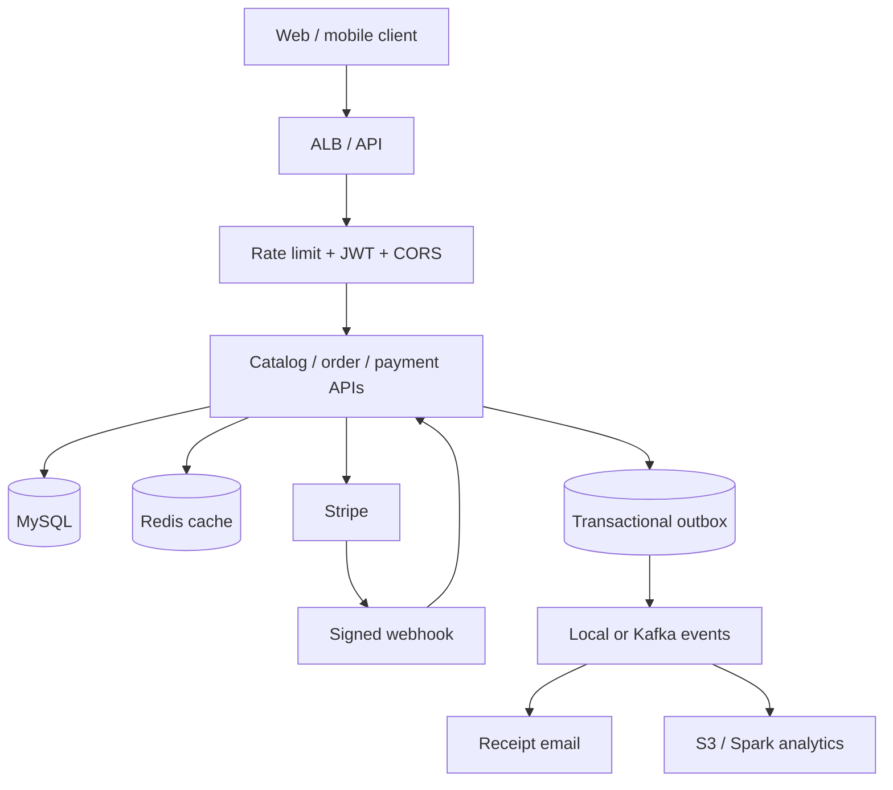

# Scaler Commerce Platform

A production-oriented Java 17 / Spring Boot 4.1 e-commerce backend. The original
classroom project has been converted into a runnable Maven application with a
secure catalog, concurrent inventory reservation, idempotent orders, payment
webhooks, reconciliation, caching, messaging, observability, automated tests,
containers, AWS infrastructure, and a companion data platform.

## What is implemented

- Versioned REST APIs with validation and one global error contract
- Product/category CRUD, search, pagination, sorting, soft deletion, and Redis-ready caching
- JPA cardinalities, lazy loading, entity graphs, batching, custom queries, locking, and Flyway migrations
- Registration/login, BCrypt password hashing, signed JWT access tokens, OAuth2 resource-server security, roles, and CORS
- Idempotent order creation with server-side totals and pessimistic stock locking
- Payment Gateway strategy/factory with a local signed mock and a Stripe Checkout adapter
- Verified, deduplicated webhooks; scheduled reconciliation; transactional-outbox receipt events
- Local/Kafka event publishers, SMTP notifications, Feign third-party catalog import
- Rate limiting, trace IDs, structured logging, Actuator health, Prometheus metrics
- Unit/Mockito/MockMvc tests, JaCoCo, GitHub Actions, Dependabot
- Multi-stage non-root Docker image and a MySQL/Redis/Kafka/Mailpit local stack
- Terraform for VPC, private subnets, security groups, ALB, ECS, RDS, Redis, S3, Route53, autoscaling, and CloudWatch
- SQL, Hive, PySpark batch/streaming, and Airflow data-pipeline examples

The exact mapping from the ten screenshots to code, infrastructure, labs, or
design documentation is in [Curriculum Coverage](docs/CURRICULUM-COVERAGE.md).

## Architecture



See [Architecture](docs/ARCHITECTURE.md) and
[Design Patterns](docs/DESIGN-PATTERNS.md) for the detailed design.

## Run locally

Requirements: Java 17 and Maven 3.9+.

The default profile uses an in-memory H2 database, local cache, and signed mock
payments, so MySQL/Redis/Kafka are not required for the first run.

```bash
mvn clean verify
BOOTSTRAP_ADMIN_EMAIL=admin@example.com \
BOOTSTRAP_ADMIN_PASSWORD='ChangeMe@123' \
mvn spring-boot:run
```

On Windows PowerShell:

```powershell
$env:BOOTSTRAP_ADMIN_EMAIL="admin@example.com"
$env:BOOTSTRAP_ADMIN_PASSWORD="ChangeMe@123"
mvn spring-boot:run
```

Open:

- Swagger UI: `http://localhost:8080/swagger-ui.html`
- Health: `http://localhost:8080/actuator/health`
- Prometheus: `http://localhost:8080/actuator/prometheus`

For the complete local infrastructure:

```bash
docker compose up --build
```

Mailpit is available at `http://localhost:8025`.

## First API flow

1. `POST /api/v1/auth/login` with the bootstrap administrator.
2. Create a category with `POST /api/v1/categories`.
3. Create products with `POST /api/v1/products`.
4. Register a customer with `POST /api/v1/auth/register`.
5. Create an order with `POST /api/v1/orders` and a unique `Idempotency-Key`.
6. Create checkout with `POST /api/v1/payments/orders/{orderId}`.
7. Send a signed mock webhook or configure Stripe credentials.

Never send an amount from the client to the payment API. The backend reads the
locked order total and sends that value to the selected gateway.

## Production configuration

Activate `prod` and provide secrets through the environment or AWS Secrets Manager:

```text
SPRING_PROFILES_ACTIVE=prod
DATABASE_URL
DATABASE_USERNAME
DATABASE_PASSWORD
REDIS_HOST
JWT_SECRET
STRIPE_API_KEY
STRIPE_WEBHOOK_SECRET
PAYMENT_SUCCESS_URL
PAYMENT_CANCEL_URL
ALLOWED_ORIGINS
```

`JWT_SECRET` must be a Base64-encoded value that decodes to at least 32 random
bytes. Do not reuse the local development secret.

## Repository guide

```text
src/main/java/                 application code
src/main/resources/db/        versioned database migrations
src/test/                      unit and web-layer tests
data-platform/                 SQL, Hive, Spark, streaming, Airflow
infrastructure/aws/            Terraform deployment
docs/                          architecture, HLD, patterns, product notes
.github/workflows/             CI
```

## Author

Ashutosh Sharma — [GitHub](https://github.com/Ashu2621)
