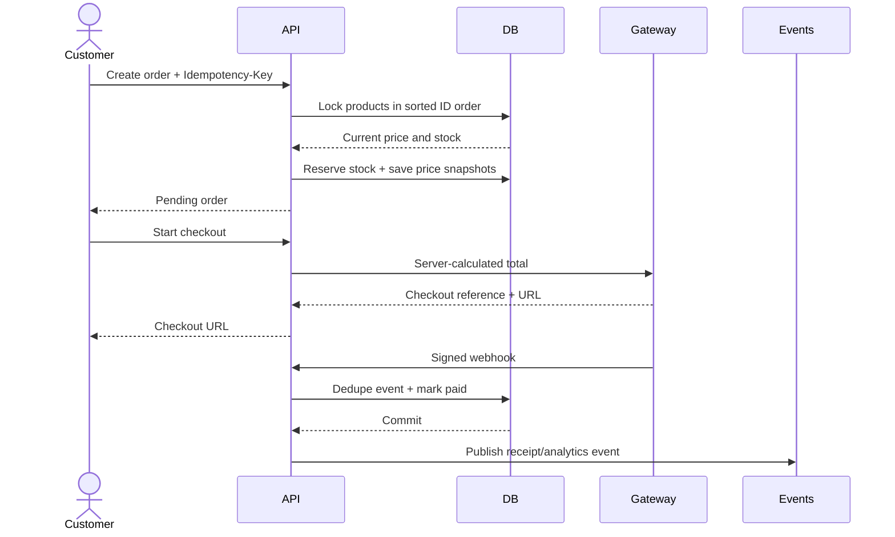
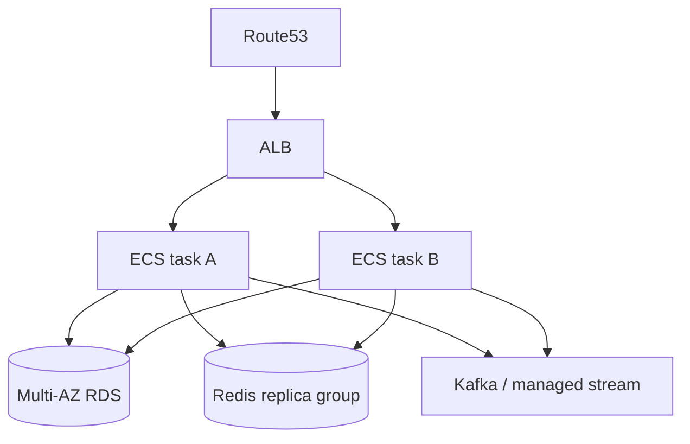

# Architecture

## Runtime boundaries

The application is a modular monolith. This is deliberate: catalog, order, and
payment transactions remain simple and strongly consistent while the code keeps
clear seams for later service extraction.

| Module | Responsibility | Main consistency rule |
|---|---|---|
| Security | BCrypt, JWT, roles, CORS, request limits | Stateless authentication |
| Catalog | Products, categories, stock, third-party import | SKU and category uniqueness |
| Ordering | Price snapshots, totals, stock reservation | One order per customer/idempotency key |
| Payment | Gateway adapters, webhook dedupe, reconciliation | One payment per order |
| Events | Receipt notification and analytics publishing | Publish only after DB commit |
| Data platform | Batch and stream analytics | Idempotent, partitioned processing |

## Order and payment sequence

Key decisions:

- Product rows use pessimistic locks while reserving inventory. IDs are sorted
  first to make lock ordering deterministic and reduce deadlock risk.
- The order stores item title, SKU, unit price, and total snapshots. Later catalog
  edits cannot change financial history.
- A unique database constraint enforces idempotency even when multiple app
  instances receive the same request.
- Webhook signatures are verified before any state mutation. Provider event IDs
  are stored under a unique constraint to make retries harmless.
- Reconciliation polls old pending payments because a webhook can be delayed or lost.

## Database and N+1 controls

- Associations are lazy by default.
- Read paths use targeted `@EntityGraph` joins and Hibernate batch fetching.
- Pages never expose JPA entities; records form stable API contracts.
- Flyway owns schema evolution. Hibernate runs in `validate`, never `update`.
- Search/sort fields are whitelisted; arbitrary property names do not reach the ORM.
- Optimistic versions prevent silent last-write-wins updates.

## Scaling path

The API is stateless, so ALB can distribute requests across tasks. RDS is the
source of truth. Redis stores reconstructable cache data. Kafka decouples
notifications and analytics. Autoscaling targets CPU while CloudWatch observes
5xx rates and ECS Container Insights.

For HTTPS, add an ACM certificate and change the Terraform listener from HTTP
forwarding to HTTP-to-HTTPS redirect plus a TLS listener.

## EC2, EBS, ECS, and RDS

- ECS Fargate is used for the stateless API; it removes instance patching and
  makes EBS unnecessary for application state.
- If the same container is placed on EC2, use an encrypted gp3 root EBS volume,
  no public SSH, SSM Session Manager, and an autoscaling group.
- Business state belongs in RDS, objects in S3, and cache state in Redis—not on EBS.
- VPC security groups permit ALB→API and API→data stores only.
