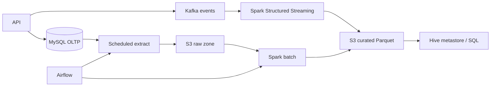

# Data platform

The transactional Spring application and analytical workloads are separated.
MySQL answers low-latency business queries; object storage plus Spark answer
large scans and historical questions.

## Concepts represented

- RDBMS/SQL: normalized operational schema, keys, constraints, indexes, joins,
  CTEs, union-all, conditional pivots, and window functions.
- Efficient querying: filter early, select required columns, index high-selectivity
  access paths, inspect `EXPLAIN`, avoid functions on indexed predicate columns,
  and never paginate deep tables with unbounded offsets at large scale.
- Hadoop: HDFS supplies replicated distributed storage and YARN schedules work.
  The project uses S3-compatible object storage for cloud deployment, but the
  partitioning and immutable-file principles are the same.
- Hive: an external, partitioned Parquet table provides schema-on-read SQL.
- Spark/PySpark: DataFrame transformations, adaptive execution, windows,
  de-duplication, repartitioning, and partitioned writes.
- Streaming: Kafka source, event-time watermark, within-watermark de-duplication,
  windowed aggregation, checkpointing, and append output.
- Orchestration: Airflow selects an hourly partition, submits Spark, and runs a
  quality gate with one active run.
- Distributed coordination: Kafka KRaft manages broker metadata; consumer groups
  assign partitions. Production Airflow uses its metadata DB and scheduler HA.
- Load balancing: partitions distribute data work; skewed keys still require
  salting, repartitioning, or a different key.

## Data pillars

1. Correctness: immutable identifiers, schema contracts, dedupe keys.
2. Reliability: checkpoints, retries, idempotent partition overwrites.
3. Quality: null, uniqueness, range, freshness, and volume checks.
4. Security: private buckets, encryption, least-privilege IAM, PII minimization.
5. Observability: input/output counts, lag, duration, failed partitions, lineage.
6. Cost: Parquet compression, partition pruning, lifecycle policies, right-sized jobs.

The example code lives under `data-platform/`.
