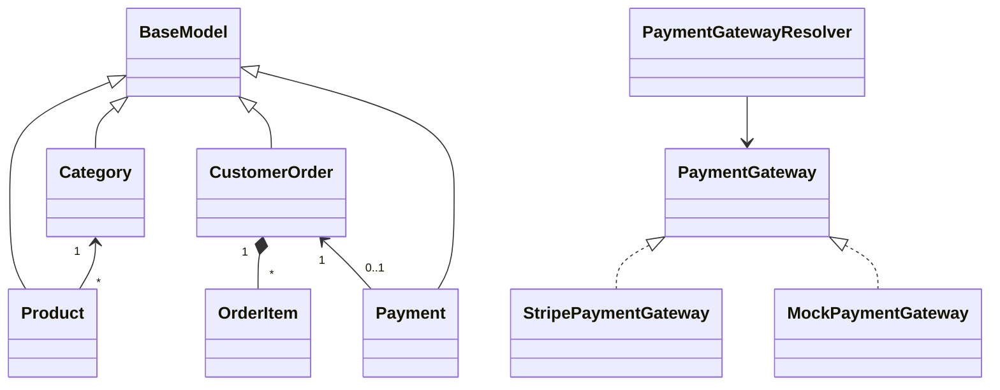

# Design patterns used

| Pattern / concept | Concrete use |
|---|---|
| Singleton | Spring-managed stateless services/configuration are singleton-scoped |
| Builder | Stripe `SessionCreateParams` and security claim/header construction |
| Prototype | Immutable request/response records are copied by construction; JPA entities are never cloned |
| Adapter | `StripePaymentGateway` adapts Stripe SDK objects to the domain `PaymentGateway` |
| Strategy | Mock and Stripe gateways implement the same payment strategy |
| Factory | `PaymentGatewayResolver` selects a strategy by provider |
| Observer | `OutboxDispatcher` fans durable `OrderPaidEvent` records out to publisher and notification observers |
| Decorator | Spring cache, transactions, security, metrics, and method interceptors wrap services |
| Repository | JPA repositories isolate persistence queries |
| DTO | Java records define input/output contracts and validation boundaries |

## OOP and Java concepts

- Encapsulation: stock can only be reduced through `Product.reserve`; payment and
  order status transitions are entity methods.
- Inheritance: all persisted aggregates inherit audit/identity/version fields from
  abstract `BaseModel`.
- Polymorphism: payment and event-publisher interfaces accept interchangeable implementations.
- Access control: constructors and mutation methods expose only what each layer needs.
- Generics: `PageResponse<T>` and repository types preserve compile-time types.
- Collections/streams/lambdas: order lines are merged, products indexed, roles mapped,
  and DTO lists created without unsafe casts.
- Exceptions: domain-specific HTTP errors replace generic `RuntimeException`.
- Concurrency: atomics protect the in-memory rate limiter; DB locks protect stock;
  scheduled outbox batches deliver post-commit notifications with retries.

## Class relationships

